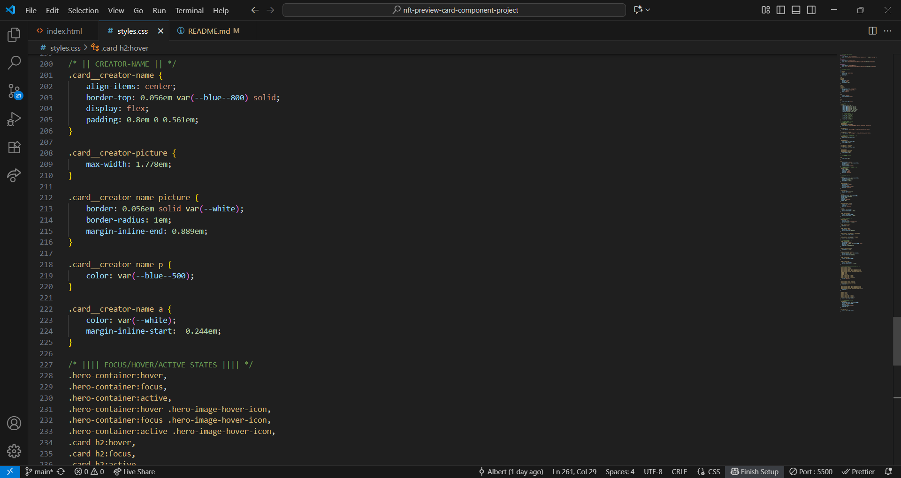

# Frontend Mentor - NFT preview card component solution

This is a solution to the [NFT preview card component challenge on Frontend Mentor](https://www.frontendmentor.io/challenges/nft-preview-card-component-SbdUL_w0U). Frontend Mentor challenges help you improve your coding skills by building realistic projects.

## Table of contents

- [Overview](#overview)
  - [The challenge](#the-challenge)
  - [Screenshot](#screenshot)
  - [Links](#links)
- [My process](#my-process)
  - [Built with](#built-with)
  - [What I learned](#what-i-learned)
  - [Continued development](#continued-development)
  - [Useful resources](#useful-resources)
- [Author](#author)
- [Acknowledgments](#acknowledgments)

## Overview

### The challenge

Estimated Time: 8hrs
Actual Time: 11:30hrs

Users should be able to:

- View the optimal layout depending on their device's screen size
- See hover states for interactive elements

### Screenshot

HTML


CSS





### Links

- Solution URL: [Github @BertSki90](https://github.com/BertSki90/nft-preview-card-component)
- Live Site URL: [Github @BertSki90](https://bertski90.github.io/nft-preview-card-component/)

## My process

### Built with

- Semantic HTML5 markup
- CSS custom properties
- Flexbox
- Mobile-first workflow

### What I learned

Overlay is new to me. I did a lot of trial and error and reading before I got the overlay working properly. I had the wrong approach to overlays.

Below I have provided the code with additional comments that are not in my source code:

```html
<picture class="hero-container">
  

  <div class="overlay"></div>

  
</picture>
```

```css
.hero-container {
  /* |||| v align-items, display, and justify-content centers the elements inseid of the container v |||| */
  align-items: center;
  display: flex;
  justify-content: center;
  /* |||| ^^^^ |||| */
  /* |||| v position prevents the children from overflowing the container v |||| */
  position: relative;
  /* |||| ^^^^ |||| */
}

.hero-image {
  border-radius: 0.444em;
  object-fit: cover;
}

.overlay {
  background-color: var(--cyan--400);
  border-radius: 0.544em;
  /* |||| v height, and width fills the entire container v |||| */
  height: 100%;
  /* || v opacity set to not visible = 0 v || */
  opacity: 0;
  /* || ^^^^ || */
  /* || v position places .overlay over .hero-image v || */
  position: absolute;
  /* || ^^^^ || */
  width: 100%;
  /* |||| ^^^^ |||| */
}

.hero-image-hover-icon {
  /* |||| v object-fit keeps original size, no resizing v |||| */
  object-fit: contain;
  /* |||| ^^^^ |||| */
  /* |||| v opacity set to not visible = 0 v |||| */
  opacity: 0;
  /* |||| ^^^^ |||| */
  /* |||| v position places .hero-image-hover-icon senter of container v |||| */
  position: absolute;
  /* |||| ^^^^ |||| */
}

.hero-container:hover .overlay,
.hero-container:focus .overlay,
.hero-container:active .overlay {
  /* |||| v makes .overlay partially visible = inbetween 0-1 v |||| */
  opacity: 0.5;
}

.hero-container:hover .hero-image-hover-icon,
.hero-container:focus .hero-image-hover-icon,
.hero-container:active .hero-image-hover-icon {
  /* |||| v makes .hero-image-hover-icon visible = 1 v |||| */
  opacity: 1;
}
```

### Continued development

Learning about overlays was great. Creating a container with an img.hero-image, div.overlay, and img.hero-image-hover-icon inside and having the img.hero-image cover the full container while hiding the other two classes. div.overlay becomes semi-transparent with cyan background color and img.hero-image-hover-icon becomes visible when cursor hovers over it.

I am getting more comfortable working with margin/padding-inline/block-start/end proprties and rem, em, and ch units.

I want to implement max-inline-size to my CSS.

I want to be more consistant in including the width, height and loading properties for images within the HTML.

### Useful resources

- [dev.to](https://dev.to/ellen_dev/two-ways-to-achieve-an-image-colour-overlay-with-css-eio) - Helpful article to create an overlay.

## Author

- Github - [@BertSki90](https://github.com/BertSki90)
- Frontend Mentor - [@BertSki90](https://www.frontendmentor.io/profile/BertSki90)
- X - [@BertSki90](https://x.com/BertSki90)

## Acknowledgments

Github - [@nakoyawilson](https://github.com/nakoyawilson/nft-preview-card-component/tree/main) - Insights on how to better use overlay. Fixed glitches I was having on the hover states, thank you!

I would like to thank Frontend Mentor and FreeCodeCamp to giving me access to their resources and community which are crucial to my code learning!
